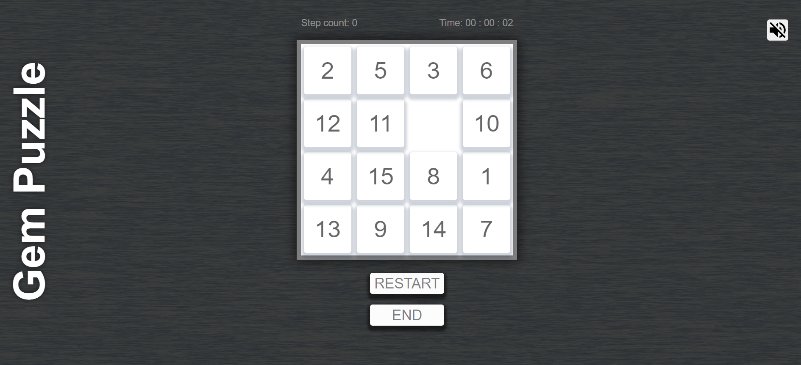

# Gem-puzzle
***
## browser game on JS
### Rules:
* 1  Move the chips one at a time to stack them in the correct order from 1 to 15. Start counting from the top left corner. 
***
### Features
* 1  all elements are generated in js;
* 2  default game field size is 4x4;
* 3  the game field is generated randomly;
* 4  restart game is possible without page reboot;
* 5  add ability to save the game in LocalStorage;
* 6  add ability to select the size of game field;
* 7  add "win!" message;
* 8  add ability to on and off sound;
* 9  adaptive design;

[play](https://gem-puzzle-kseniamv.netlify.app/);

### Image
;

